# MCC — Model Context Catalog

MCC is an MCP server that acts as a permission-controlled catalog of tools. It exposes pre-defined **Python functions and shell commands** to Claude and other LLM clients through a unified `search` / `execute` interface, with authentication and group-based access controls built in.

MCC is written in Python/FastMCP and uses Elasticsearch or OpenSearch for a data store and fastembed for semantic search.

---

## How it works



The MCP client uses just two primary tools:

- **`search(query)`** — finds tools by natural language (hybrid keyword + semantic search), returns signatures with relevance scores
- **`execute(key, params)`** — runs a tool by key, validates params, checks permissions

```
Claude → search("deploy") → ["myteam.deploy - Deploys the app  execute(environment: str = 'dev')"]
Claude → execute("myteam.deploy", {"environment": "prod"})  →  result
```

### Why only two tools?

Most MCP servers expose every capability as a separate named tool. MCC takes the opposite approach: the catalog itself is the interface, and the LLM navigates it dynamically.

LLM context windows fill up with tool definitions — with 30+ tools loaded, a significant portion of every request is spent just describing what's available, and tool selection degrades as the list grows. `search` and `execute` give the model a two-step interface to an arbitrarily large collection of tools instead: it asks "what can help me here?" before acting, rather than scanning a fixed manifest. You can register hundreds of tools without bloating the context — only the ones the model actually finds and uses consume tokens.

## Key features

- **Two tool types**: point at any Python callable (`fn:`) which runs in the server's interpreter or wrap any shell command (`exec:`) which can run any interpreter
- **Tool spec templates**: can interpolate env vars `${MYVAR}` at load time and then `{{ param | quote }}` at execute time for safe shell interpolation, with conditionals and list expansion
- **Semantic and keyword search** over your tool catalog and gives ranked results for the LLM to pick from. powered by Elastic or OpenSearch and FastEmbed
- **Group-based access control** tools specs define `groups` and users are stored in the configured search backend (Elasticsearch or OpenSearch). users can be granted tool access via `groups`  or specific `tools`
- **Auth backends**: GitHub OAuth, Google, Azure, and more — or dev mode (`dev-admin`)
- **Resource limits** at the tool level to limit the cpu/mem/etc for any tool's subprocess. 
- **Audit log**: saves tool searches and execute user, param and errors in search index
- [**Session variables**](https://c-research.github.io/model-context-catalog/tools/session.html): session store for variables that can be referenced between tools
- [**Web UI**](https://c-research.github.io/model-context-catalog/ui.html): authenticated web interface to login via api key to search and exeucte tools
- [**Contrib tools**](https://c-research.github.io/model-context-catalog/toolsets/index.html): optional built-ins for HTTP, filesystem, shell, text processing, and more
- [**OSINT tools**](https://c-research.github.io/model-context-catalog/toolsets/index.html#osint): options addons to search osint services like OpenSanctions, EDGAR, urlscan and >40 more
## Quickstart

```bash
uv add model-context-catalog
```

See the [Installation](https://c-research.github.io/model-context-catalog/getting-started/installation.html) and [Quick Start](https://c-research.github.io/model-context-catalog/getting-started/quickstart.html) guides for setting up Elasticsearch/OpenSearch, configuring auth, and defining your first tool.

## Documentation

Full docs live at **[c-research.github.io/model-context-catalog](https://c-research.github.io/model-context-catalog/)**:

- [MCP Interface](https://c-research.github.io/model-context-catalog/mcp.html) — the `search`/`execute` contract
- **Getting Started**: [Installation](https://c-research.github.io/model-context-catalog/getting-started/installation.html) · [Quick Start](https://c-research.github.io/model-context-catalog/getting-started/quickstart.html) · [Configuration](https://c-research.github.io/model-context-catalog/getting-started/configuration.html)
- **Tools**: [YAML Format](https://c-research.github.io/model-context-catalog/tools/yaml-format.html) · [Python Tools](https://c-research.github.io/model-context-catalog/tools/python.html) · [Exec Tools](https://c-research.github.io/model-context-catalog/tools/exec.html) · [Parameters](https://c-research.github.io/model-context-catalog/tools/parameters.html) · [Session Store](https://c-research.github.io/model-context-catalog/tools/session.html) · [Environment Variables](https://c-research.github.io/model-context-catalog/tools/env-vars.html) · [Resource Limits](https://c-research.github.io/model-context-catalog/tools/limits.html)
- **Auth & Permissions**: [Overview](https://c-research.github.io/model-context-catalog/auth/overview.html) · [Users & Groups](https://c-research.github.io/model-context-catalog/auth/users-groups.html) · [Auth Backends](https://c-research.github.io/model-context-catalog/auth/backends.html)
- [CLI Reference](https://c-research.github.io/model-context-catalog/cli.html)
- [Extra Toolsets](https://c-research.github.io/model-context-catalog/toolsets/index.html) — utils (HTTP, filesystem, shell, text, time, archives) and OSINT (threat intel, corporate records, geolocation, and more)

Project inspiration: [How to build an enterprise-grade MCP registry](https://www.infoworld.com/article/4145014/how-to-build-an-enterprise-grade-mcp-registry.html)
