# Model Context Catalog

MCC is an MCP server that acts as a permission-controlled catalog of tools. It exposes pre-defined **Python functions and shell commands** to Claude and other LLM clients through a unified `search` / `execute` interface, with authentication and group based access controls built in.

MCC is written in Python FastMCP and uses Elastic Search for a data store and fastembed for semantic search

## How it works

The MCP client uses just two tools:

- **`search(query)`** — finds tools by natural language (hybrid keyword + semantic search), returns signatures with relevance scores
- **`execute(key, params)`** — runs a tool by key, validates params, checks permissions

## Why only two tools?

Most MCP servers expose every capability as a separate named tool. MCC takes the opposite approach: the catalog itself is the interface, and the LLM navigates it dynamically.

**The problem with many tools:** LLM context windows fill up with tool definitions. With 30+ tools loaded, a significant portion of every request is spent just describing what's available — before any actual work happens. Tool selection also degrades as the list grows; models struggle to choose well from large flat lists.

**The catalog approach:** `search` and `execute` give the model a two-step interface to an arbitrarily large collection of tools. The model asks "what can help me here?" before acting, rather than scanning a fixed manifest. You can register hundreds of tools without bloating the context — only the ones the model actually finds and uses consume tokens.

This also makes the catalog self-documenting. The model learns about tools on demand, in the context where it needs them, rather than loading all descriptions upfront.

## Key features

- **Two tool types**: point at any Python callable (`fn:`) which runs in the server's interpreter or wrap any shell command (`exec:`) which can run any interpreter
- **Tool spec templates**: can interpolate env vars `${MYVAR}` at load time and then `{{ param | quote }}` at execute time for safe shell interpolation, with conditionals and list expansion
- **Semantic and keyword search** over your tool catalog and gives ranked results for the LLM to pick from. powered by Elasticsearch and FastEmbed
- **Group-based access control** tools specs define `groups` and users are stored in ES. users can be granted tool access via `groups`  or specific `tools`
- **Auth backends**: GitHub OAuth, GitHub PAT, or dev mode (`dev-admin`)
- **Resource limits** at the tool level to limit the cpu/mem/etc for any tool's subprocess. 
- **Contrib tools**: optional built-ins for HTTP, filesystem, shell, text processing, and more
- **Hot reload** catalog tool defs without restarting the server
- **MCP resources and prompts** for catalog browsing and guided workflows

Project inspiration [How to build an enterprise-grade MCP registry](https://www.infoworld.com/article/4145014/how-to-build-an-enterprise-grade-mcp-registry.html)

## Next steps

- [Installation](getting-started/installation.md)
- [Quick Start](getting-started/quickstart.md)
- [MCP Interface](mcp.md)

