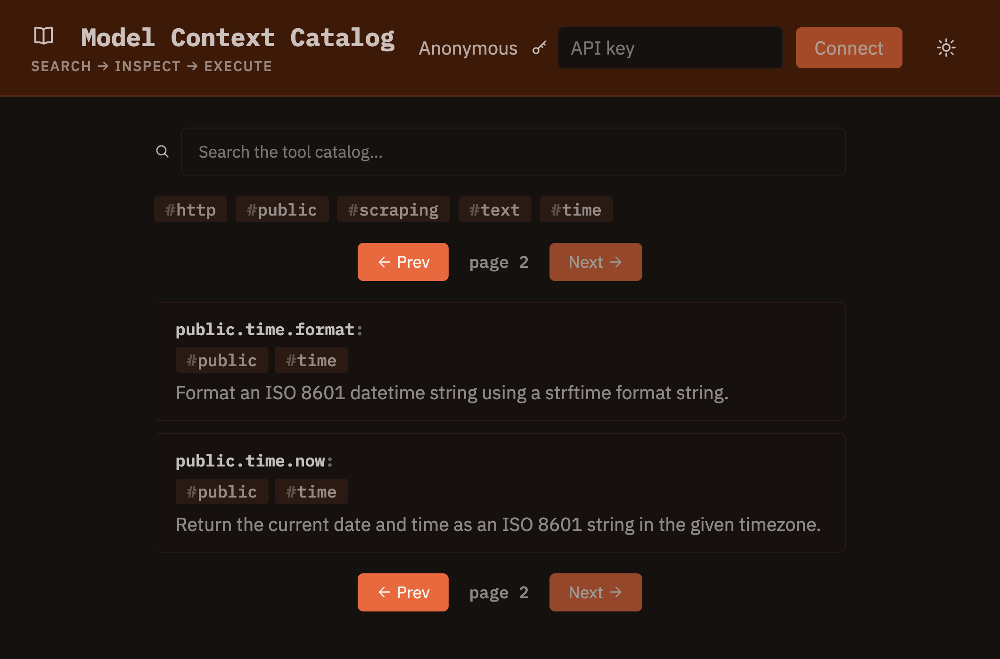

# Web UI

An optional built-in single-page app for browsing, searching, and calling the tool catalog from a browser — the human-facing counterpart to the [MCP interface](mcp.md) and [HTTP API](http-api.md), for a maintainer auditing what's in a catalog or a user deciding what to enable. It has no logic of its own beyond what those two already expose: everything it does is a thin client over `/tools`, `/search`, and `/tools/{key}`.


<!-- screenshot pending -->

## Enabling it

The UI is off by default and has to be built once before it can be served:

```bash
make ui
```

This installs the UI's dependencies, builds the SPA (`ui/dist`), and copies the result into `mcc/static/ui`. Then set:

```yaml
ui_enabled: true
```

(or `MCC_UI_ENABLED=true`) and start the server as usual. It's served at `/ui`, mounted alongside every other route — no separate process, same host and port.

If `ui_enabled` is true but the SPA was never built, `/ui` 404s (with a warning logged server-side) instead of failing startup — same degrade-don't-crash posture as `/readyz`. Re-run `make ui` after any change to `ui/src`; nothing watches or rebuilds it automatically.

## What it does

**Search and browse.** An empty search box lists the caller's accessible tools (`GET /tools`); typing a query switches to `GET /search`, debounced. Both are paginated by the server 10 at a time — Prev/Next walk `has_more`/`next_offset` rather than fetching everything up front.

**Filter by group.** Group tags appear both in a dedicated filter row and inline on each tool's card — clicking either toggles it as a filter. This narrows what's visible on the *currently loaded page* only: there's no server-side group filter, and fetching every page just to build a client-side-filterable set would defeat the point of the server paginating at all.

**Inspect a tool.** Selecting a card opens its detail: key, groups, and its `description` rendered as markdown (matching how the backend itself treats that field), plus its `example` call signature verbatim.

**Call it.** The form below renders one field per parameter: native inputs for `str`/`int`/`float`/`bool`; a tag-chip input for `list` params and a key/value row editor for `dict` params (both are free-form — the API doesn't expose an item or value type to constrain them against). A single "Edit list/dict params as JSON" toggle switches every such field to a raw textarea for anything the structured editors can't represent (nested objects, lists of objects).

**See the result.** `POST /tools/{key}`'s response is pretty-printed when it parses as JSON, and shown verbatim otherwise — some tools (`exec:`-backed ones especially) can return a bare Python tuple repr as a normal 200 result, which isn't JSON at all. A copy button copies exactly what's displayed.

**Identity.** Anonymous by default, scoped to public tools only, same as an unauthenticated HTTP API caller. Pasting an API key authenticates the session (stored in `localStorage`, sent as `X-API-Key`) and shows the resolved username and groups; signing out clears it.

**Theme.** Light/dark toggle, sharing this docs site's own color palette (`orange.css`) — the UI and the docs always look like the same product.
